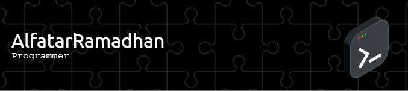

## Hey there 👋
I'm Alfatari, a fullstack web developer who learns by building real-world systems.

### 🧠 Learning by Building

I actively learn new technologies and concepts by turning real-world problems
into programming projects.

Most of my projects are case-study driven — focused on understanding business
processes, system workflows, and technical trade-offs rather than just finishing
features.

### 🚧 Case Study Projects

**Axara App**  
News portal and press management system built as a learning case study.  
Focus areas:
- Editorial workflow
- Role-based access control
- Content lifecycle management  

**Furneka**  
ERP and e-commerce system for a furniture business (case study).  
Focus areas:
- Business process modeling
- Inventory & order flow
- Backend system architecture  

**WO App**  
Wedding organizer booking & vendor management system.  
Focus areas:
- Multi-role user flows
- Scheduling & booking logic
- Data consistency across features

### 🛠️ Tech Stack

Laravel · Vue.js · PHP · JavaScript  
MySQL · REST API · Role-based Access Control

### 🔁 Continuous Learning

- Exploring system design through real business scenarios  
- Refactoring and improving existing codebases  
- Learning from mistakes and iterating on architecture decisions

##### Expertise

  )  

##### Contact

 

<!--
**alfatari-ramadhan/alfatari-ramadhan** is a ✨ _special_ ✨ repository because its `README.md` (this file) appears on your GitHub profile.

Here are some ideas to get you started:

- 🔭 I’m currently working on ...
- 🌱 I’m currently learning ...
- 👯 I’m looking to collaborate on ...
- 🤔 I’m looking for help with ...
- 💬 Ask me about ...
- 📫 How to reach me: ...
- 😄 Pronouns: ...
- ⚡ Fun fact: ...
-->
